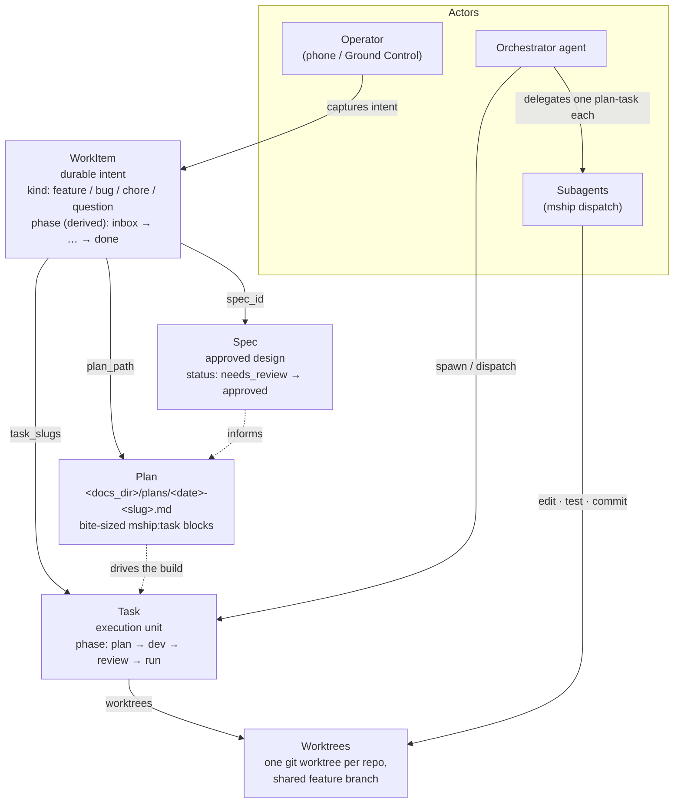

# How mship fits together

mship is a **substrate** between AI coding agents and a running multi-repo system: it owns the hand-off boundary (what's the unit of work, which repos it spans, what's real about the running system) and leaves code generation and reasoning to the agents. This page explains the core objects — **WorkItem, Spec, Plan, Task, worktrees** — the **actors** (you, the orchestrator agent, subagents), and how they relate.

## The object model

A **WorkItem** is the durable spine: the intent behind a piece of work. Everything else hangs off it — the design (Spec), the how (Plan), the execution (Tasks), and the conversation (mailbox threads).

- **Solid arrows** are stored links (a WorkItem records its `spec_id`, `plan_path`, and `task_slugs`; a Task records its `worktrees`).
- **Dashed arrows** are the conceptual flow: the Spec informs the Plan, the Plan drives the Task's build.

## The lifecycle

Work flows from an idea to merged PRs. Feature work items pass through three gates before development; bugs and chores skip the design gates.

```mermaid
graph LR
    IDEA(["idea / phone capture"]) --> WIC["mship item new<br/>→ WorkItem"]
    WIC --> SPECN["mship spec new / draft / apply<br/>→ needs_review"]
    SPECN --> APPR["review + mship spec approve<br/>→ approved"]
    APPR --> PLANW["writing-plans skill<br/>→ &lt;docs_dir&gt;/plans/*.md"]
    PLANW --> SPAWN["mship spawn / spec dispatch<br/>→ Task + worktrees (phase: plan)"]
    SPAWN --> GATE{"phase plan → dev<br/>gates"}
    GATE -->|"WorkItem + spec + plan gates pass"| DEV["dev<br/>(subagents build the plan)"]
    DEV --> REV["review"] --> RUN["run"]
    REV --> FIN["mship finish<br/>→ PRs"]
    RUN --> FIN
    FIN --> CLOSE["merge + mship close"]

    subgraph phone["Phone loop (async)"]
      SERVE["mship serve + mailbox"]
      GC["Ground Control / phone"]
      SERVE <--> GC
    end
    SPAWN -.->|"handoff event"| SERVE
    FIN -.->|"PR-merge event"| SERVE
```

For **bug** and **chore** work items the design gates don't apply: `item new --kind bug` → `spawn` → build → `finish`. Only **feature** work items require an approved spec **and** a plan.

## The objects, one at a time

**WorkItem** — the durable unit of intent, created with `mship item new "<title>" --kind <feature|bug|chore|question>`. It's the spine the phone-facing cockpit is built around. Its phase (`inbox → shaping → ready → in_flight → review → done`) is **derived, not stored**: only a `phase_override` is persisted, and the phase is otherwise computed on read (`core/view/workitem_index.py::compute_phase`) as a projection of the linked Spec's `status` plus a Task-finished overlay. So it's a coarse cockpit view of where the work sits — not an independent lifecycle you drive directly (contrast the **Task** phase below, which *is* a stored, explicitly-driven state). It links a Spec (`spec_id`), a Plan (`plan_path`), Tasks (`task_slugs`), mailbox threads, and external links. Every Task must belong to a WorkItem — that's the first gate.

**Spec** — the approved design for a feature, a workspace artifact at `<workspace>/specs/<date>-<id>.md` (markdown-canonical, branch-stable). Lifecycle: `mship spec new → draft → apply` (lands in `needs_review`) → review (`mship spec review` / `verdict` / `request-changes`) → `mship spec approve` → `dispatch`. The spec is the *what and why*; it's authored during brainstorming, before any code. (The `mship spec` object lives canonically in `specs/`, and that's what the feature **approved-spec gate** checks via the SpecStore. One rough edge to know: `phase dev`'s separate *soft* warning searches the task-scoped blessed-spec path and the legacy `spec_paths` default `docs/superpowers/specs` — **not** `specs/` — so a spec that exists only as an `mship spec` can still trip that soft "no spec" warning even when the real approved-spec gate is satisfied. Collapsing the dual location is tracked cleanup.)

**Plan** — the *how*: a bite-sized, TDD-oriented implementation breakdown at `<docs_dir>/plans/<date>-<slug>.md`, produced by the `writing-plans` skill. Each task is wrapped in `<!-- mship:task id=N -->` anchors so `mship dispatch --plan-task N` can hand one task to a subagent. Plans are first-class and gated for features (see Gates); build dispatch is minted **from the plan** once one exists.

**Task** — the execution unit. `mship spawn` (or `mship spec dispatch`) creates a Task bound to a WorkItem (and, for features, an approved Spec), with one git **worktree per affected repo** on a shared feature branch. A Task moves through phases `plan → dev → review → run` and carries per-repo test results, PR URLs, and drift audits. The agent operates on "the task"; mship tracks which files across which repos belong to it.

**Worktrees** — isolation. Each Task gets a real `git worktree` per repo, checked out on the task's feature branch, separate from `main`. A pre-commit hook and a Claude Code PreToolUse guard (`mship _guard-edit`) refuse edits/commits to a repo's main checkout while a task is active, so parallel tasks never collide.

## The three gates

The WorkItem/spec/plan gates fire at `phase plan → dev` and at `mship finish` (never at `spawn`, so you can create work before designing it):

1. **WorkItem gate** — every task must belong to a WorkItem (`spawn` requires `--work-item <id>`, or `--hotfix` to override). Applies to all kinds.
2. **Spec gate** — a **feature** WorkItem needs an approved linked spec. Bypass: `--bypass-spec-gate` (phase) / `--hotfix` (finish).
3. **Plan gate** — a **feature** WorkItem needs a valid implementation plan (resolved via `plan_path` or the `<docs_dir>/plans/<date>-<slug>.md` convention — `docs_dir` defaults to `docs` — containing at least one `mship:task` anchor). Bypass: `--bypass-plan-gate` / `--hotfix`.

Bug and chore work items pass straight through — only features carry the design/plan gates.

The **WorkItem-required** gate is enforced more broadly than the phase/finish transitions: the git pre-commit/pre-push hooks and the Claude Code PreToolUse edit-guard (`mship _guard-edit`) also refuse commits/edits from a worktree whose task lacks a WorkItem, with `MSHIP_BYPASS_GATE=1` as the escape hatch. So the object model isn't just discipline injected into a prompt (as in a pure skills system) — it's enforced in code and at the git/edit boundary, which an agent can't rationalize past. The CLI bypasses (`--hotfix`, `--bypass-spec-gate`, `--bypass-plan-gate`) are recorded to `.mothership/bypass-log.jsonl`. (The PreToolUse edit-guard's `MSHIP_BYPASS_GATE=1` escape is **not** currently logged — a small audit gap worth closing.)

## Agents and subagents

- **The orchestrator agent** is the session driving the work: it brainstorms the spec, writes the plan, spawns the task, and owns integration (`mship finish`, review, close). It holds the coordination context.
- **Subagents** are fresh, single-purpose agents the orchestrator dispatches with `mship dispatch --task <slug> --plan-task N` (or `-i "<instruction>"`). Each gets a self-contained prompt — the worktree to `cd` into, the branch state, recent journal, and one plan-task to implement — and reports back without opening its own PR. This is the `subagent-driven-development` pattern: one fresh subagent per plan-task, two-stage review (spec compliance, then code quality) between tasks, so context stays clean and work stays parallel-safe across worktrees.

`mship dispatch` is how a plan becomes work: with a linked plan, `mship dispatch --task <slug> --plan-task N` mints the implementer prompt straight from the plan; `mship spec dispatch <id>` binds an approved spec to a task and hands off the acceptance criteria (pointing at the plan once one exists).

## The phone loop (serve + mailbox)

`mship serve` runs a JSON API over the spec + task model — the backend for the **Ground Control** phone app — plus a durable **mailbox** for two-way async messages between you and an agent. A running agent watches the mailbox (`mship inbox wait`) and the turn boundary (`mship _drain` Stop hook) so it sees your replies, dispatch handoffs, and PR-merge events without polling. This is what lets you drive the whole lifecycle above — capture intent, approve a spec, steer a build, merge a PR — from your phone.

## The unattended runner (autonomous execution)

Beyond the interactive loop, mship can run WorkItems autonomously. A WorkItem marked `unattended` becomes eligible for the cloud runner: `mship item run-next` selects the next ready unattended item (keyed off the derived WorkItem phase), carries it through the lifecycle, and `mship item bail` / `heartbeat` handle giveback + liveness; `core/pr_watcher.py` posts a PR-merge event back to the mailbox. It's the same object model driven by a scheduler instead of a human — the phone loop and the unattended loop share the WorkItem / Spec / Plan spine. (This layer is newer than the interactive path; treat it as the autonomous complement to the phone control plane.)

## Who relates to whom (at a glance)

| Object | Created by | Links to | Gated? |
|---|---|---|---|
| WorkItem | `mship item new` | Spec, Plan, Tasks, threads | is the gate (required for every task) |
| Spec | `mship spec new` (brainstorming) | one WorkItem | feature dev/finish needs it approved |
| Plan | `writing-plans` skill | one WorkItem (`plan_path`) | feature dev/finish needs it to exist |
| Task | `mship spawn` / `spec dispatch` | one WorkItem, one Spec, N worktrees | passes the gates to reach `dev` |
| Worktree | `mship spawn` | one Task, one repo | edit-guarded vs main |

## See also

- [`docs/cli.md`](cli.md) — the full command surface (grouped by the same concepts).
- [`docs/configuration.md`](configuration.md) — `mothership.yaml` fields.
- The `working-with-mothership` skill (`mship skill install`) — the canonical operating guide for agents inside a workspace.
