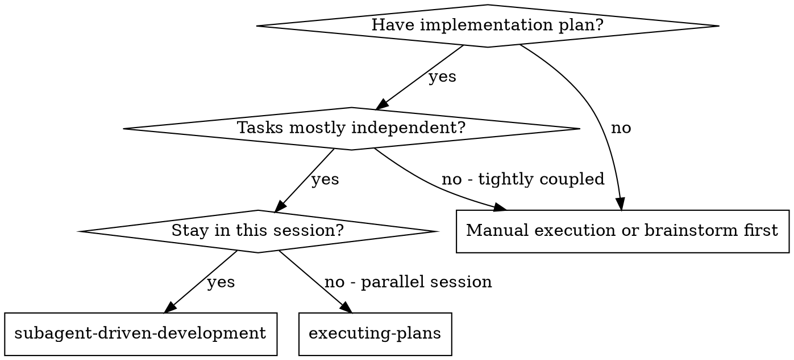
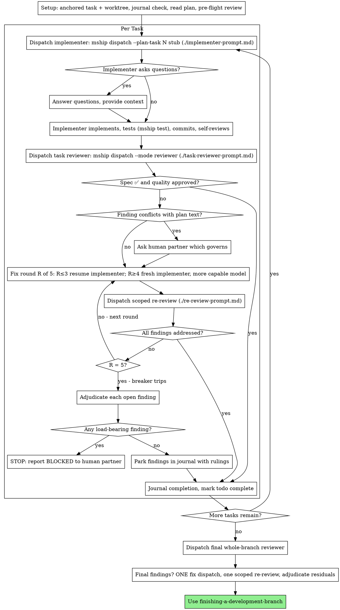

# Subagent-Driven Development

Execute plan by dispatching a fresh implementer subagent per task, a task review (spec compliance + code quality) after each, and a broad whole-branch review at the end.

**Why subagents:** You delegate tasks to specialized agents with isolated context. By precisely crafting their instructions and context, you ensure they stay focused and succeed at their task. They should never inherit your session's context or history — you construct exactly what they need. This also preserves your own context for coordination work.

**Core principle:** Fresh subagent per task + task review (spec + quality) + broad final review = high quality, fast iteration

**If this is a mothership workspace** (i.e. there's a `mothership.yaml` at the
repo root or any ancestor): before dispatching ANY implementer subagent, verify
there is an active mship task with a worktree. Run `mship status`.

`mship status` always emits the same envelope shape: `.active_tasks[]` lists
every active task, and `.resolved_task` is the resolved task's full detail
(keys like `slug`, `phase`, `branch`, `worktrees`, …) — or `null` when no task
resolves from context (cwd / `MSHIP_TASK` / `--task`).

- If `.active_tasks` is empty (`mship status | jq '.active_tasks'` → `[]`), no
  tasks exist — stop. Every task needs a WorkItem: tell the user to create one
  (`mship item new "<title>" --kind <feature|bug|chore|question>`) then spawn
  against it (`mship spawn "<description>" --work-item <id>`) before you
  dispatch anything.
- If `.active_tasks` is non-empty but `.resolved_task` is `null`, multiple
  tasks are active and no single one is anchored. Pick one with the user and
  pass `--task <slug>` (or set `MSHIP_TASK=<slug>`) on every subsequent mship
  command, then `cd` into that task's worktree before dispatching.
- Otherwise `.resolved_task` is the resolved task (`mship status | jq
  .resolved_task`). Every subagent's working directory is
  `.resolved_task.worktrees.<repo>`.

Subagents work and commit inside that worktree, never on `main`. This is what
keeps worktree isolation intact across the whole plan execution. See
`./implementer-prompt.md` for the full pre-dispatch checklist, and
`working-with-mothership`'s "Context isolation (SDD flow)" section for the
dispatch mechanics this skill builds on — the two must be used together, and
that section is authoritative on the CLI contract.

**Narration:** between tool calls, narrate at most one short line — the
journal and the tool results carry the record.

**Continuous execution:** Do not pause to check in with your human partner between tasks. Execute all tasks from the plan without stopping. The only reasons to stop are: BLOCKED status you cannot resolve, ambiguity that genuinely prevents progress, or all tasks complete. "Should I continue?" prompts and progress summaries waste their time — they asked you to execute the plan, so execute it.

## When to Use



**vs. Executing Plans (parallel session):**
- Same session (no context switch)
- Fresh subagent per task (no context pollution)
- Review after each task (spec compliance + code quality), broad review at the end
- Faster iteration (no human-in-loop between tasks)

## The Process



## Setup

Ensure the work happens in an isolated workspace. In a mothership workspace
the task's worktree already exists (`mship spawn` created it) — verify it via
the `mship status` envelope walk above. Outside mothership, use
using-git-worktrees to create or verify one. Never start implementation on a
main/master branch without your human partner's explicit consent.

Conversation memory does not survive compaction. In real sessions,
controllers that lost their place have re-dispatched entire completed task
sequences — the single most expensive failure observed. Track progress in
durable state, not only in todos. In a mothership workspace that durable
state already exists — do not invent a ledger file:

- **The task journal** (`mship journal "<entry>"`) is the append-only
  progress record. Journal each task completion, fix round, parked finding,
  and adjudication as it happens. Read it back with `mship journal --last N`;
  every `mship dispatch` prompt also carries the recent journal, so subagents
  see it too.
- **Dispatch records** live under `.mothership/sdd/` — `mship dispatch
  --plan-task N` persists one per dispatch (metadata only). They are
  CLI-owned, git-ignored, and cleaned up by `mship close`; never edit them by
  hand.
- **TodoWrite** tracks the in-session task list, as always.

The journal is your recovery map: the commits it names exist in git even
when your context no longer remembers creating them. After compaction, trust
`mship journal --last 20` and `git log` over your own recollection — a task
with a journaled completion line is DONE; do not re-dispatch it. A task whose
last journal line is a fix round is mid-loop: resume the loop at the next
round.

Read the plan once, note its context and Global Constraints, and create a
todo per task. The plan's tasks must carry mship anchor blocks
(`<!-- mship:task id=N -->` … `<!-- /mship:task -->`, per writing-plans) —
`mship dispatch --plan-task N` extracts the task text by anchor id.

Before dispatching Task 1, scan the plan once for conflicts:

- tasks that contradict each other or the plan's Global Constraints
- anything the plan explicitly mandates that the review rubric treats as a
  defect (a test that asserts nothing, verbatim duplication of a logic block)

Present everything you find to your human partner as one batched question —
each finding beside the plan text that mandates it, asking which governs —
before execution begins, not one interrupt per discovery mid-plan. If the
scan is clean, proceed without comment. The review loop remains the net for
conflicts that only emerge from implementation.

## Model Selection

**In a Mothership workspace**, `mship dispatch` resolves the model:
`--model` flag > `dispatch_models:` map in mothership.yaml > the portable
built-in default. Every built-in mode defaults to `inherit`; explicit
CLI/config values are opaque operator choices and must remain unchanged.

Read the stub's resolved model before dispatch:
- `inherit`: omit the harness model selector; the harness default is intended.
- any other value: pass it unchanged through a supported model selector.
- if the available subagent API has no model selector, do not dispatch with
  an explicit value. Report: "mship resolved explicit model '<value>', but this subagent API cannot select a model; set this mode to inherit or use a selector-capable dispatch tool."
Never translate one provider's model name into another.

**Outside a Mothership workspace**, where the controller chooses a model
itself, match capability to task complexity:
- Mechanical implementation with a complete spec and a small isolated surface:
  use a fast, economical model.
- Multi-file integration, debugging, or review requiring judgment: use a
  generally capable model.
- Architecture, broad codebase reasoning, and the final whole-branch review:
  use the most capable available model.
- For a stuck fix loop, escalate to a more capable available model.

Turn count matters alongside token price: choose a model likely to complete the
task reliably rather than optimizing for the lowest per-token price alone.

## The Task Loop

Everything you paste into a dispatch prompt — and everything a subagent
prints back — stays resident in your context for the rest of the session
and is re-read on every later turn. Hand artifacts over as files. The
dispatch mechanics below implement exactly the "Context isolation (SDD
flow)" contract in `working-with-mothership` — read that section once; this
skill adds the review loop around it.

### 1. Dispatch the implementer

Record BASE (`git rev-parse HEAD` in the worktree) before dispatching —
fix-round scoping needs it. (`mship dispatch` records its own base in the
dispatch record; this copy is for your bookkeeping.)

- **The stub is the handoff:** run
  `mship dispatch --task <slug> --plan-task <N>` (add `--plan <path>` only if
  the plan can't be auto-resolved). It persists the dispatch record under
  `.mothership/sdd/` and prints a **closed stub** — record path, resolved
  model, mode, worktree, and the emit line. Do NOT expand the stub yourself:
  launch the subagent with cwd set to the worktree and the stub's resolved
  model, using `./implementer-prompt.md` as the wrapper. The subagent's
  first command is `mship dispatch --emit`, which derives its full prompt
  (plan-task slice + live spec AC text + worktree, phase, journal, bases) in
  its own context — the task text never transits yours. For an ad-hoc
  instruction not in the plan, use `mship dispatch -i "<text>"` (or
  `-i -` for stdin); exactly one instruction source is allowed.
- The default mode is **implementer** — it scopes the subagent to the single
  task and tells it to report back, NOT open a PR. That's what you want:
  you (the orchestrator) own integration and run `mship finish` after the
  final review. Don't reach for `--mode standalone` (the open-your-own-PR
  contract) for plan-task execution.
- **Report file:** name the implementer's report file after the plan task,
  next to the dispatch record the stub printed (record
  `…/record.json` → report `…/task-N-report.md`), and put the path in
  the dispatch wrapper. The implementer writes the full report there and
  returns only status, commits, a one-line test summary, and concerns.
- A dispatch wrapper describes one task, not the session's history. Do not
  paste accumulated prior-task summaries ("state after Tasks 1-3") into
  later dispatches — a real session's dispatch hit 42k chars of which 99%
  was pasted history. A fresh subagent needs its emitted task, the
  interfaces it touches from earlier tasks, and your resolution of any
  ambiguity. Nothing else — the emit carries the rest.
- If an earlier task parked a finding in the area this task touches, carry
  a pointer to that journal entry in the dispatch.
- Record the implementer's agent identity from the dispatch result —
  fix-loop rounds 1-3 resume this agent.
- Never dispatch multiple implementation subagents in parallel (conflicts).

Template: [implementer-prompt.md](implementer-prompt.md)

### 2. Handle the report

Implementer subagents report one of four statuses. Handle each appropriately:

**DONE:** Confirm the report shows `mship test` green (implementers run
`mship test`, never bare runners, so `mship finish` finds the passing-test
evidence it gates on). Then dispatch the task reviewer (next section).

**DONE_WITH_CONCERNS:** The implementer completed the work but flagged doubts. Read the concerns before proceeding. If the concerns are about correctness or scope, address them before review. If they're observations (e.g., "this file is getting large"), note them and proceed to review.

**NEEDS_CONTEXT:** The implementer needs information that wasn't provided. Provide the missing context and re-dispatch.

**BLOCKED:** The implementer cannot complete the task. Assess the blocker:
1. If it's a context problem, provide more context and re-dispatch with the same model
2. If the task requires more reasoning, re-dispatch with a more capable model
3. If the task is too large, break it into smaller pieces
4. If the plan itself is wrong, escalate to the human

**Never** ignore an escalation or force the same model to retry without changes. If the implementer said it's stuck, something needs to change.

If the implementer asks questions — before starting or mid-task — answer
clearly and completely, provide additional context if needed, and don't
rush it into implementation.

### 3. Review the task

Per-task reviews are task-scoped gates. The broad review happens once, at the
final whole-branch review. Never skip the task review, and never accept a
report missing either verdict — spec compliance AND task quality are both
required. Implementer self-review never replaces the task review; both are
needed.

- **The review package is CLI-built:** run
  `mship dispatch --mode reviewer --task <slug>`. It diffs each affected
  repo from the prior dispatch's recorded base to live HEAD, writes the
  package (one raw diff file per repo + `manifest.json`) under the record's
  `review/` directory, and prints a closed stub. Launch the reviewer with
  cwd set to the worktree and the stub's resolved model; its first command
  is `mship dispatch --emit`, which prints the diff-file paths, the
  manifest path, the live acceptance criteria, and the read-only
  dual-verdict contract — never diff content. The reviewer reads the diff
  files from disk; the package never enters your context. Never dispatch a
  task reviewer without a package.
- **Reviewer inputs:** the emitted package covers the diff and the spec's
  acceptance criteria. Your dispatch wrapper
  ([task-reviewer-prompt.md](task-reviewer-prompt.md)) adds what the CLI
  cannot know: the plan-task reference, the implementer's report-file path,
  and the global constraints that bind the task.
- The global-constraints block you hand the reviewer is its attention
  lens. Copy the binding requirements verbatim from the plan's Global
  Constraints section or the spec: exact values, exact formats, and the
  stated relationships between components ("same layout as X", "matches
  Y"). The reviewer's template already carries the process rules (YAGNI,
  test hygiene, review method) — the constraints block is for what THIS
  project's spec demands.
- Do not add open-ended directives like "check all uses" or "run race tests
  if useful" without a concrete, task-specific reason
- Do not ask a reviewer to re-run tests the implementer already ran on the
  same code — the implementer's report carries the test evidence
- Do not pre-judge findings for the reviewer — never instruct a reviewer to
  ignore or not flag a specific issue. If you believe a finding would be a
  false positive, let the reviewer raise it and adjudicate it in the review
  loop. If the prompt you are writing contains "do not flag," "don't treat X
  as a defect," "at most Minor," or "the plan chose" — stop: you are
  pre-judging, usually to spare yourself a review loop.
The task reviewer may report "⚠️ Cannot verify from diff" items — requirements
that live in unchanged code or span tasks — and the package itself may
disclose skipped repos (the manifest records any affected repo it could not
diff, with the reason). These do not block the rest of the review, but you
must resolve each one yourself before marking the task complete: you hold
the plan and cross-task context the reviewer lacks. If you confirm an item
is a real gap, treat it as a failed spec review — it enters the fix loop
with the other findings.

Template: [task-reviewer-prompt.md](task-reviewer-prompt.md)

### 4. The fix loop

The loop triggers when the review reports spec ❌, any Critical or Important
finding, or a ⚠️ item you confirmed as a real gap.

Before the loop starts, two routes leave it immediately:

- Journal Minor findings as you go
  (`mship journal "Task <N>: minor (deferred): <one-liner>"`), and point the
  final whole-branch review at those entries so it can triage which must be
  fixed before merge. A roll-up nobody reads is a silent discard. Minor
  findings never enter the loop.
- A finding labeled plan-mandated — or any finding that conflicts with
  what the plan's text requires — is the human's decision, like any plan
  contradiction: present the finding and the plan text, ask which governs.
  Do not dismiss the finding because the plan mandates it, and do not
  dispatch a fix that contradicts the plan without asking.
Everything else enters the loop. A fix round is one fix dispatch plus one
scoped re-review. Five rounds maximum per task:

**Rounds 1-3 — resume the original implementer.** Send it the open findings
verbatim. Its context is intact: it knows the task, the code, and its own
choices. If your harness cannot send another message to a live subagent,
dispatch a fresh implementer via `mship dispatch -i -` with the
findings, the report-file path, and the covering-test names as the
instruction — the report file is the persistent memory either way.

**Rounds 4-5 — dispatch a fresh implementer on a more capable model** (per
Model Selection; pass `--model` on the dispatch), with the report-file path,
the open findings, and this framing: "A prior implementer attempted this task
[N] times; you own it now. Read the report file for what was tried." A loop
that survives three resumes usually means the implementer cannot see its
own problem — fresh eyes and a capability bump in one move.

**Every round, either way:** the implementer fixes, re-runs `mship test`
(or the focused tests covering the amended code, with `mship test` before
committing), appends its fix report to the same report file, and returns
the short contract. Before re-dispatching the reviewer, confirm the fix
report contains the covering tests, the command run, and the output;
dispatch the re-review once all three are present. Name the covering test
files in the fix message — a one-line fix does not need the whole suite.

**The re-review is scoped.** Re-run `mship dispatch --mode reviewer` — the
rebuilt package diffs to the new HEAD — and dispatch
[re-review-prompt.md](re-review-prompt.md) with the findings list, the
report file, and FIX_BASE (the head the previous review saw), so the
re-reviewer confines judgment to the fix commits within the package. The
re-reviewer verdicts each finding ADDRESSED or NOT ADDRESSED and flags new
breakage in the fix diff only. New Critical/Important breakage in the fix
diff joins the open findings list. Out-of-scope observations go to the
journal as deferred minors — they never extend the loop.

**After each round,** journal it:
`mship journal "Task <N>: fix round <R>/5 (<X> addressed, <Y> open — <finding one-liners>; commits <a7>..<b7>)"`

Never fix findings yourself in the controller session — your context stays
clean for coordination, and controller fixes skip review.

**The breaker.** When round 5's re-review still leaves findings open, stop
dispatching. Adjudicate each open finding yourself — you hold the plan and
the cross-task context the reviewer lacks:

- **The reviewer is wrong, or the point is contestable:** park it —
  `mship journal "Task <N>: parked — <finding> — ruling: <why the code stands>"`.
  The final review sees both sides.
- **Real, but nothing downstream builds on it:** park it the same way, with
  a ruling that says it's real and deferred.
- **Real and load-bearing** — a later task builds on it, or it reveals a
  plan defect: STOP. Journal `Task <N>: BLOCKED — <reason>` and report to
  your human partner with the finding, the plan text it collides with, and
  the fix history. Parking a structural failure lets every dependent task
  build on it and hands the final review a problem it cannot fix either.

Adjudicate only at the cap. Adjudicating earlier to end a loop is
pre-judging with a different name. Every adjudication is a journal entry —
a silent discard is forbidden.

### 5. Complete the task

When the review comes back clean — or every open finding is parked with a
ruling at the cap — journal the completion:

- `mship journal "Task <N>: complete (commits <base7>..<head7>, review clean)"`
- `mship journal "Task <N>: complete (commits <base7>..<head7>, <K> parked)"`
  after a tripped breaker

Then mark the todo complete and move on. Never move to the next task while
the review has open Critical/Important issues that are neither fixed nor
parked-with-ruling at the cap.

## Final Review

The final whole-branch review gets its diff as files too: `mship export`
assembles the task's per-repo whole-branch diffs (plus journal, plan, and
spec) into a bundle directory — include the bundle path in the final review
dispatch so the final reviewer reads files instead of re-deriving the branch
diff with git commands. Dispatch on the most capable available model (see
Model Selection), using requesting-code-review's
[code-reviewer.md](../requesting-code-review/code-reviewer.md). Point it at
the journal's deferred-minor and parked entries (`mship journal --last 50`
filtered to this plan's tasks) so it can triage which must be fixed before
merge.

If the final whole-branch review returns findings, dispatch ONE fix subagent
with the complete findings list — not one fixer per finding.
Per-finding fixers each rebuild context and re-run suites; a real
session's final-review fix wave cost more than all its tasks combined.
Then run exactly one scoped re-review of the fix wave
(`mship dispatch --mode reviewer` rebuilds the package to the fixed HEAD;
[re-review-prompt.md](re-review-prompt.md) scoped to the fix range).
Adjudicate any residual findings as in the task loop's breaker: park with
rulings, or stop on load-bearing ones. There is no second fix wave —
residual load-bearing findings surface to your human partner when
finishing-a-development-branch presents the options.

## Finish

When the final whole-branch review is clean and its fixes are merged, use
finishing-a-development-branch — in a mothership workspace that routes
through `mship finish`, which you (the orchestrator) run, never a subagent.
The dispatch records under `.mothership/sdd/` are CLI-owned scratch:
`mship close` removes them with the rest of the task state; don't delete
them by hand.

## Common Rationalizations

| Excuse | Reality |
|--------|---------|
| "Close enough on spec compliance" | Reviewer found spec gaps = not done. Fix or hit the cap and adjudicate — those are the only exits. |
| "I'll fix it myself, dispatching is overhead" | Controller fixes pollute your context and skip review. Resume the implementer. |
| "One more round will converge" | Past the cap, rounds don't converge — the failure is structural. Adjudicate and route. |
| "The reviewer will just find something new anyway" | Scoped re-reviews verify fixes; they cannot wander. New findings on untouched code go to the journal, not the loop. |
| "This finding is obviously wrong, I'll drop it" | You adjudicate only at the cap, and every ruling is a journal entry. Silent discards are forbidden. |
| "The fix was small, skip the re-review" | Unreviewed fixes are how regressions land. Every round ends with a scoped re-review. |
| "Reviews slow the loop down" | The loop without reviews is just unverified churn. Reviews are the loop's brakes and steering. |
| "Journal bookkeeping is overhead" | The journal is what survives compaction. Controllers without one have re-dispatched entire completed task sequences. |

## Example Workflow

```
You: I'm using Subagent-Driven Development to execute this plan.

[mship status → .resolved_task populated, worktree verified]
[Read plan file once: docs/plans/feature-plan.md — anchored task blocks present]
[mship journal --last 20 → no completion lines, fresh start]
[Create todos for all tasks]

Task 1: Hook installation script

[mship dispatch --plan-task 1 → stub: record path, model, emit line]
[Dispatch implementer: cwd=worktree, stub's model, wrapper names the report file]

Implementer: [runs mship dispatch --emit, reads its task]
  "Before I begin - should the hook be installed at user or system level?"

You: "User level (~/.claude/hooks/)"

Implementer: [Later]
  - Implemented install-hook command
  - Added tests, mship test green (5/5)
  - Self-review: Found I missed --force flag, added it
  - Committed

[mship dispatch --mode reviewer → package built; dispatch task reviewer with wrapper]
Task reviewer: [runs mship dispatch --emit, reads the diff files]
  Spec ✅ - all ACs satisfied, nothing extra.
  Strengths: Good test coverage, clean. Issues: None. Task quality: Approved.

[mship journal "Task 1: complete (commits a1b2c3d..d4e5f6a, review clean)"]

Task 2: Recovery modes

[mship dispatch --plan-task 2 → stub; dispatch implementer]

Implementer: [No questions]
  - Added verify/repair modes
  - mship test green (8/8)
  - Committed

[mship dispatch --mode reviewer → package rebuilt; dispatch task reviewer]
Task reviewer: Spec ❌:
  - Missing: Progress reporting (spec says "report every 100 items")
  Issues (Important): Magic number (100)

[Fix round 1: resume the implementer with both findings]
Implementer: Added progress reporting, extracted PROGRESS_INTERVAL constant.
  Re-ran test/recovery.test.js — 10/10 passing. Fix report appended.

[mship dispatch --mode reviewer → package to new HEAD; dispatch scoped re-review with FIX_BASE]
Re-reviewer: Missing progress reporting — ADDRESSED (src/recovery.js:41).
  Magic number — ADDRESSED (src/recovery.js:7). New breakage: none.
  Verdict: all findings addressed.

[mship journal "Task 2: fix round 1/5 (2 addressed, 0 open; commits d4e5f6a..b7c8d9e)"]
[mship journal "Task 2: complete (commits d4e5f6a..b7c8d9e, review clean)"]

...

[After all tasks]
[mship export → bundle with per-repo whole-branch diffs; dispatch final code-reviewer, most capable model]
Final reviewer: All requirements met. Deferred minors triaged: none block merge.

Done! Using finishing-a-development-branch (orchestrator runs mship finish).
```
